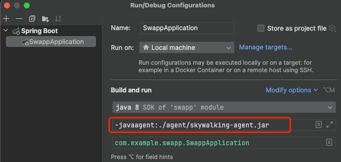

## Skywalking Java Application Demo

This is a demo project for Skywalking Java agent, which shows how to use Skywalking Java agent in a Java application.

## Pre-install

### 1. Install Skywalking Java agent

Download Skywalking Java agent from [Skywalking official website](https://skywalking.apache.org/downloads/), and unzip
it.

```shell
wget https://dlcdn.apache.org/skywalking/java-agent/8.16.0/apache-skywalking-java-agent-8.16.0.tgz \
  && mkdir agent \
        && tar -zxvf apache-skywalking-java-agent-8.16.0.tgz -C ./agent --strip-components 1
```

### 2. Update Skywalking Java agent config

Update `agent.config` file in `./agent/config` directory, and set `collector.backend_service` to your Skywalking OAP
server address.

```shell
# Set service name
agent.service_name=${SW_AGENT_NAME:java-app}

# Set Skywalking OAP server address
collector.backend_service=${SW_AGENT_COLLECTOR_BACKEND_SERVICES:127.0.0.1:11800}
```

### 3. Update Skywalking Java agent JVM options

Add `-javaagent` option to your Java application.



## How to run

### 1. Build the demo project

```shell
mvn clean package
```

### 2. Run the demo project

```shell
java \
-javaagent:./agent/skywalking-agent.jar \
-jar target/swapp-0.0.1-SNAPSHOT.jar
```

## License

[Apache 2.0 License.](/LICENSE)